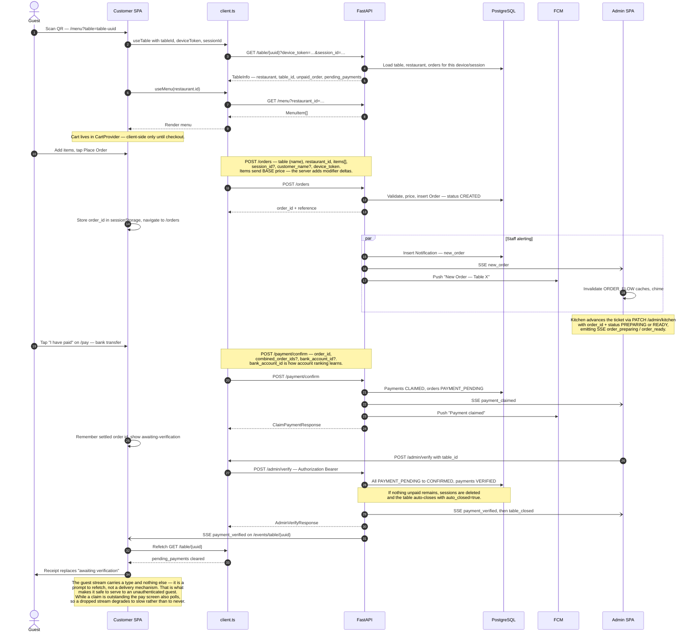
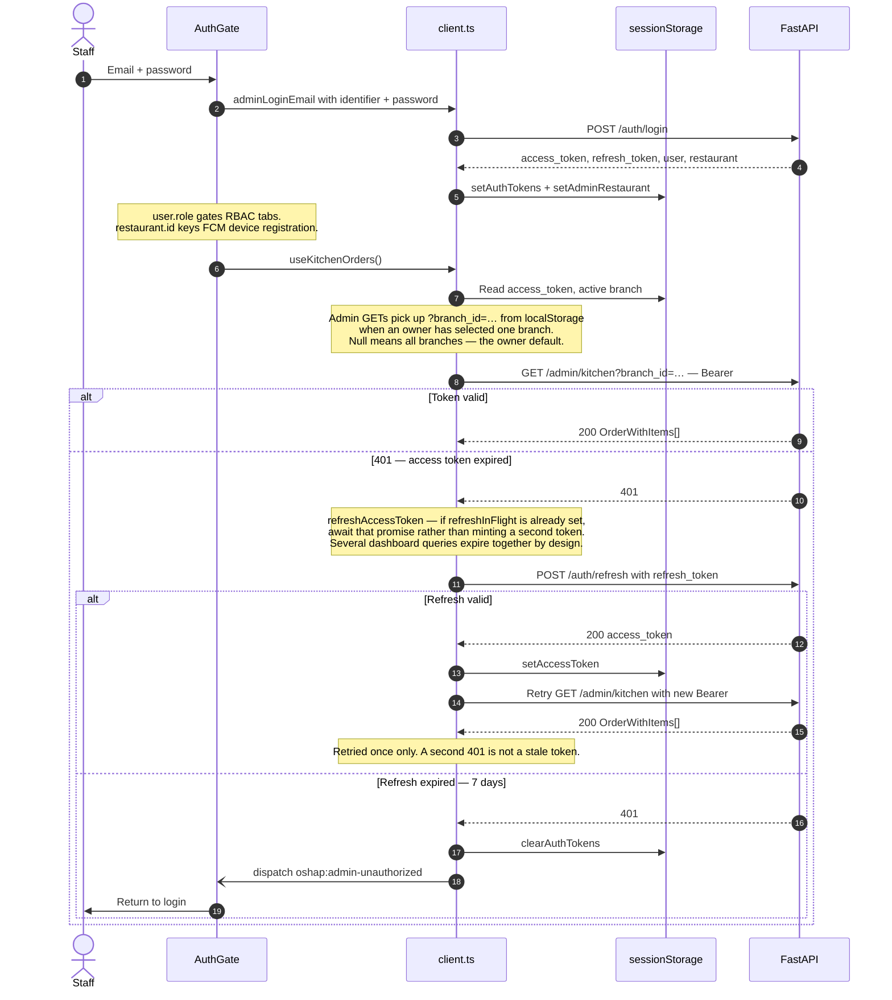
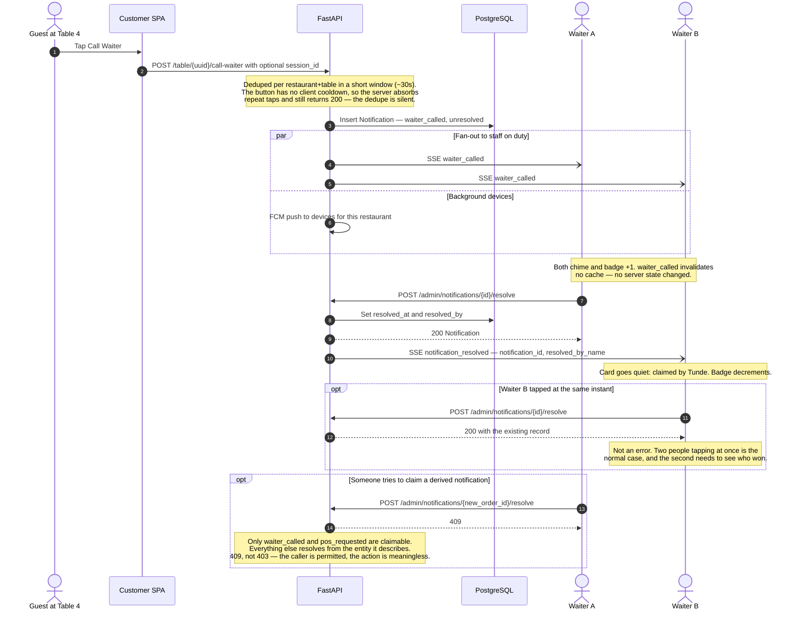
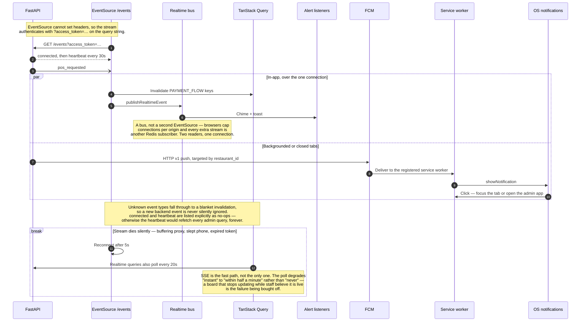
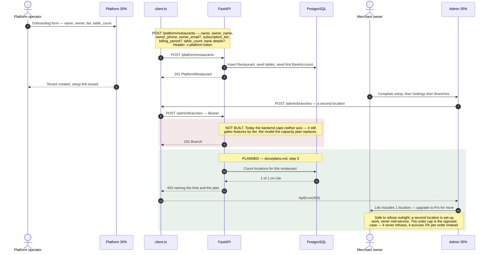

# Oshap — sequence diagrams

End-to-end flows across `apps/customer`, `apps/admin`, `apps/platform`,
`@oshap/shared` and the FastAPI backend.

Every endpoint below is mounted under `/api/v1` — the shared client prepends
`API_PREFIX` to the origin in `VITE_API_BASE_URL`
([`client.ts:272`](../packages/shared/src/api/client.ts#L272)). Paths in the
diagrams are written without the prefix, as they appear in
[`openapi.yaml`](openapi.yaml).

Two conventions worth stating once, because they surprise people:

- **There is no `/customer/*` namespace.** The guest-facing endpoints sit at the
  root: `/menu`, `/table/{id}`, `/orders`, `/payment/confirm`, `/session`.
- **A table `id` is a uuid, not a name.** Table names repeat across restaurants,
  so `T4` would resolve to whichever tenant the server matched first. The
  customer app carries the uuid in `?table=`; `TableInfo.table_id` is the
  human-readable name, used for display and for `CreateOrderRequest.table`.

---

## 1. Customer order and payment lifecycle

A guest scans a table QR, orders, claims payment, and staff verify it.



**Status chain:** `CREATED → PREPARING → READY → PAYMENT_PENDING → CONFIRMED`.
There is no `PAID` status.

Verification is **per table**, not per order: `POST /admin/verify` takes a
`table_id` and settles every `PAYMENT_PENDING` order on it.

`POST /orders/confirm` exists in the spec and is wrapped by `useConfirmOrders`,
but no app calls it — settlement is driven entirely from the admin side.

---

## 2. Admin auth, branch scoping, and single-flight refresh

Staff sign in with email and password. Access tokens last 15 minutes, so expiry
mid-shift is routine rather than exceptional.



Tokens live in `sessionStorage`, not `localStorage`, so closing the tab ends the
session. The refresh token is what spares staff from retyping a password every
15 minutes.

> **On the name `adminPin`:** admin paths in [`openapi.yaml`](openapi.yaml) are
> tagged `security: [{ adminPin: [] }]`, which reads like PIN auth and is not.
> The scheme is defined as `type: http, scheme: bearer, bearerFormat: JWT` — the
> key is historical, and the `x-admin-pin` header it names is gone. The 4-digit
> PIN that *does* still exist is unrelated: it belongs to shared-table sessions
> (`POST /session` with `action=JOIN`), and guests use it, not staff.

---

## 3. Staff notifications and the claim mechanism

Alerts exist to stop three waiters walking to the same table.



**Claimed vs derived.** `waiter_called` and `pos_requested` have no entity to
watch, so a person resolves them. `payment_claimed` resolves when the payment is
verified or rejected; `new_order` when the order leaves `CREATED`; `order_ready`
when the order closes; `low_stock` when stock rises. See
[`notifications.md`](notifications.md).

---

## 4. Realtime delivery — one stream, one bus, one poll floor

How an event reaches an admin tab, and what happens when the stream dies without
saying so.



Device tokens are registered with `POST /devices/register` (admin-scoped) and
looked up by `restaurant_id` when an event fires
([`fcm-notifications.md`](fcm-notifications.md)).

**FCM is admin-only.** No Firebase import exists in `apps/customer`, and none
should be added. [`ws-relay.js`](../ws-relay.js) at the repo root is a local dev
helper for testing multi-tab sync — it is not part of the production transport,
which is SSE.

---

## 5. Platform onboarding, and the plan caps that are not built yet



**Plans differ by capacity, not capability.** Every tier gets the whole product,
and only two axes separate them
([`tiers.data.ts`](../apps/platform/src/tiers.data.ts)):

| | Lite | Standard | Pro | Enterprise |
|---|---|---|---|---|
| Monthly | ₦8,000 | ₦18,000 | ₦35,000 | ₦100,000 |
| Monthly orders | 10,000 | ∞ | ∞ | ∞ |
| Locations | 1 | 1 | ∞ | ∞ |
| Staff, tables, features | ∞ / all | ∞ / all | ∞ / all | ∞ / all |

Order volume separates Lite from Standard; locations separate Standard from Pro.
Staff accounts and tables are **unlimited everywhere** — both were proposed as
caps and both were dropped, because they bite during service, which is the one
time a limit must never bite. Annual is ten months' worth on every plan, derived
from the monthly figure rather than written out, so the two cannot drift.

Phase 1 sells **Lite, Standard, Pro**. Enterprise is in `TIER_ORDER` so existing
records still read, but not in `PHASE_1_TIERS`, so the onboarding picker will not
offer it.

### What is actually true today

[`plans.md`](plans.md) is blunt about it: *None of this is built.* Observed on a
fresh Lite tenant, 19 August 2026:

```
/admin/menu               200
/admin/settings           200
/admin/staff              200
/admin/tables             403   ← a QR code is per table
/admin/kitchen            403
/admin/ingredients        403
```

That is the inverse of the commercial decision — a Lite restaurant currently
cannot manage tables, and so cannot produce the QR codes that are the entire
product. Removing the feature gates is step 1 and blocks the rest.

The two axes enforce differently. A location cap refuses outright — a second
branch is set-up work, and nobody is mid-service when it is refused. The order
cap never refuses anything: past 10,000 orders in a month, Lite accrues **2% of
order value on each subsequent order** until the restaurant upgrades. Service is
untouched, the guest's total is unchanged, and nothing about it reaches the
customer app. `orderUsage()` and `USAGE_WARN_AT = 0.8` warn the owner at 8,000,
so the charge is never a surprise. See [`plans.md`](plans.md).

---

## Summary

| Flow | Trigger | Endpoints | Transport | Auth |
|---|---|---|---|---|
| **1. Order and payment** | Guest scans a table QR | `GET /table/{id}`, `GET /menu`, `POST /orders`, `POST /payment/confirm`, `POST /admin/verify` | HTTP JSON; SSE + FCM to staff only | Guest: none (`device_token`). Verify: Bearer |
| **2. Auth** | Login, and any 401 | `POST /auth/login`, `POST /auth/refresh`, `GET /auth/me` | HTTP JSON | Bearer — 15m access, 7d refresh, single-flight |
| **3. Notifications** | Call waiter, POS request, order events | `POST /table/{id}/call-waiter`, `POST /table/{id}/request-pos`, `POST /admin/notifications/{id}/resolve` | SSE + FCM | Bearer, RBAC by role and branch |
| **4. Realtime transport** | Any domain event | `GET /events?access_token=…`, `POST /devices/register` | SSE, plus a 20s poll floor, plus FCM web push | Access token in query (SSE); Bearer (register) |
| **5. Onboarding** | Operator creates a tenant | `POST /platform/restaurants`, `POST /admin/staff` | HTTP JSON | `x-platform-token`; Bearer |

### The guest's live channel, and its deliberate limits

`apps/customer` opens exactly one `EventSource`, on the pay screen, via
`useTableEvents` → `GET /events/table/{id}`. It exists because payment
verification is a manual act by staff: the guest does not trigger the
transition that turns their screen into a receipt, so without a push they sit
on "awaiting verification" until they think to reload.

Three constraints shape it, and each is a decision rather than an oversight:

- **The stream returns no data.** Messages carry a `type` and nothing the client
  reads beyond it. Every guest-visible fact still arrives through
  `GET /table/{id}`, which was already public. A stream that delivers nothing
  cannot widen what an unauthenticated caller can see.
- **Unknown event types are ignored, not refetched on.** The admin stream does
  the opposite — an unrecognised type triggers a broad invalidation so a new
  backend event is never silently missed. Here, an unrecognised type means the
  backend started sending guests something nobody designed for, and reacting to
  it would be guessing.
- **It is scoped to the pay screen, and polls only while a claim is open.** A
  guest's phone sleeps and backgrounds far more than a till does, so the pay
  screen also polls at `REALTIME_POLL_MS` while `pending_payments` is set — the
  same fast-path-plus-floor shape the admin board uses. The menu and orders
  screens keep the old behaviour: no stream, no poll, 30-second `staleTime`.

> **Backend dependency.** `/events/table/{id}` is specified in
> [`openapi.yaml`](openapi.yaml) but not yet implemented. Until it is, the
> `EventSource` fails and retries every 5s, and the poll on the pay screen is
> what actually delivers the receipt — which is the degradation it was put
> there for.
